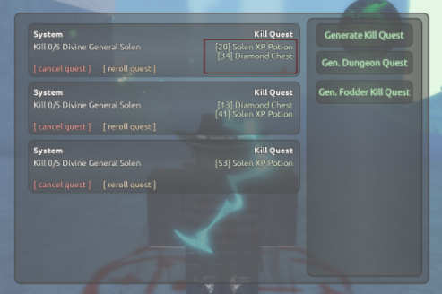
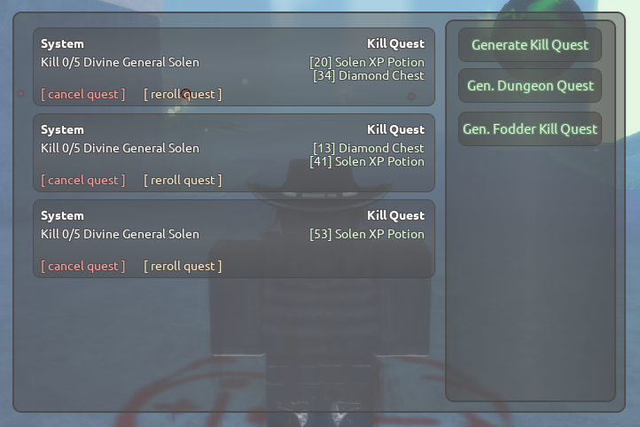

# niepogoda's reroll script

[](https://github.com/dwyl/esta/issues) 


This script automates the process of rerolling quests in ***Lee:// RPG***. It utilizes OCR to read from screen.

## Prerequisites

Before using this script, ensure you have the following installed:

- Python (version 3.10.6 or higher recommended)
- Required Python packages (install via `pip install -r requirements.txt`)
- Windows operating system

## Setup Instructions

1. **Install Python:**
   - If Python is not installed, download it from [python.org](https://www.python.org/downloads/) and follow the installation instructions.

2. **Install Dependencies:**
   - Open a command prompt or terminal.
   - Navigate to the directory containing `reroll.py` and `requirements.txt`.
   - Run the following command to install required packages:
     ```
     pip install -r requirements.txt
     ```

3. **Configure Screen Regions:**
   - Run `py regions.py`. This script allows you to select specific regions on your screen where quests and reroll buttons are located.
   - Follow the on-screen instructions to select regions for Quests 1, 2, 3, and their respective reroll buttons.
   - Save the regions when prompted. This will generate a `regions.json` file that `reroll.py` will use.

   **How to select those areas?** <br>
    <br>
    <br>

   **Make sure to leave some margins around the text and to not get the *Kill Quest* label in the area!**

4. **Configure `config.json`:**
   - Ensure `config.json` is present in the script's directory with the following parameters:
     - `minimum_chests`: Minimum number of chests required in each quest.
     - `delay`: Delay (in seconds) between each reroll.
     - `start_keybind`: Keyboard key to start the reroll process.
     - `kill_keybind`: Keyboard key to stop the script.

5. **Run the Script:**
   - Ryb `py reroll.py` to execute the script.
   - Once started, press `start_keybind` (configured in `config.json`) to begin the reroll process.
   - Press `kill_keybind` to stop the script at any time.

## Notes

- **Logging:** Detailed logs are written to `latest.log` in the script's directory. Check this file for information on script operations and any errors encountered.
- **Pull requests:** If you want to make a pull request, please do it at `tests` branch!

## Troubleshooting

- If the script does not behave as expected, ensure all dependencies are correctly installed and configured.
- Check `latest.log` for error messages or warnings that may indicate issues with screen resolution or configuration files.

For further assistance, contact me on Discord or refer to the documentation of the libraries used in this script.
